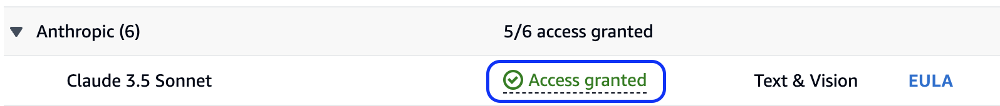
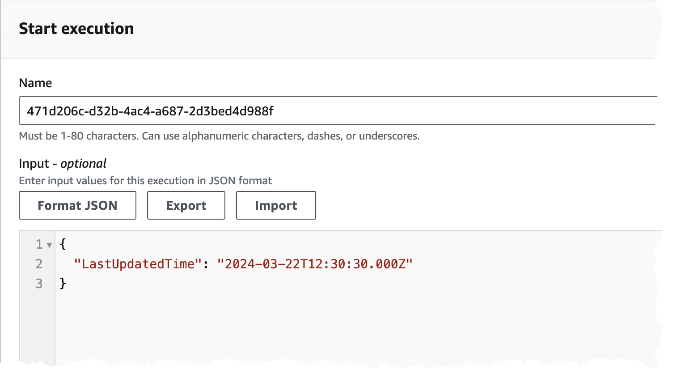
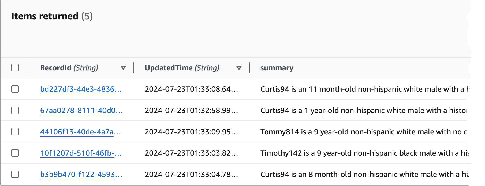

# Overview

The following CDK application will deploy resources required for the generative AI workflow orchestrator solution.

## Pre-requisites

The [AWS Cloud Development Kit (CDK)](https://docs.aws.amazon.com/cdk/v2/guide/home.html) is required to install this application. Follow the [Getting Started](https://docs.aws.amazon.com/cdk/v2/guide/home.html) instructions for details on installing the AWS CDK CLI and preparing your AWS account.

This application was built with Python 3.12. Create a python virtual environment to install the dependencies for this application:

```bash
python -m venv .venv
source .venv/bin/activate
pip install -r requirements.txt
```

Finally, request access to the appropriate model in [Amazon Bedrock](https://aws.amazon.com/bedrock/) if you haven't already done so. By default, this solution uses "Claude 3.5 Sonnet", so please make sure that is enabled in the Amazon Bedrock [model access console](https://console.aws.amazon.com/bedrock/home?#modelaccess):



> [!IMPORTANT]
> This solution relies on Bedrock model availability which may vary by region. To deploy this solution as is, please use one of the following regions: `us-east-1`, `us-west-2`. If you try to deploy this solution in a region not listed it will result in an error!

## Deployment

Use the following steps to deploy the CDK application into your environment:

1. Export the following environment variables, please replace the example AWS account Id and AWS region with values that are specific to your environment:

```bash
export CDK_ACCOUNT=012345678910
export CDK_REGION=us-east-1
```

2. Update [cdk.context.json](cdk.context.json) with values that are unique to your environment. Most values can and should be left to their defaults. Ones that may require updates:

```
# Set a tag key / value pair for this project - helpful for tracking costs
"project_tag_key": "Project"
"project_tag_value": "GenAI-Workflow-Orchestrator"
"environment_tag_key": "Environment"
"environment_tag_value": "Development"
```

Review the remaining values and update as necessary.

3. Synthesize the application before deploying into your AWS account:

```bash
cdk synth
```

4. If you deploying CDK application for the first time in your AWS region, please boostrap the environment:

```bash
cdk bootstrap
```

5. Assuming no errors, deploy the application:

```bash
cdk deploy
```

> [!NOTE]
> It could take up to 30 mins for the solution to deploy.

## Test

> [!NOTE]
> Please allow a few minutes (up to 10 minutes) after deploying the solution before executing this step, so that synthetic data has been synchronized to the HealthLake analytic data store.

This solution is powered by [AWS Step Functions](https://aws.amazon.com/step-functions/). To start, you'll need to pass a timestamp parameter to the `GenAIWorkflow` state machine. Go to the [state machines](https://console.aws.amazon.com/states/home?#/statemachines) console and click on the **GenAIWorkflow** state machine. At the top right, click the **Start Execution** button. Pass a parameter similar to the following:

```json
{
  "LastUpdatedTime": "2024-03-22T12:30:30.000Z"
}
```



Assuming everything is successful, the results will be stored in a DynamoDB table. Open the [DynamoDB console](https://console.aws.amazon.com/dynamodbv2/home?#tables) and look for a table called `genai-workflow-orchestrator-results`. Click on the table and click on the **Explore table items** button at the top right. You should see a single item with the results.



## Changing the prompt template

The default generative AI prompt template used in this sample solution is stored in a file named [prompt-template](./model_prompts/prompt-template). During the deployment of this solution, the prompt template content is uploaded to an AWS System Manager Parameter Store named **"/genai-workflow-orchestrator/prompt-template"** (specified at field `prompt_template_parameter_name` in [cdk.context.json](./cdk.context.json)). If you'd like to adjust the prompt template please either update the Parameter Store value or update the [prompt-template](./model_prompts/prompt-template) file content and rerun CDK deploy.

> [!NOTE]
> In the prompt template, the first `{}` is a place holder for the actual report content. The `GenAIWorkflow` state machine replaces the place holder with each patient clinical report content before sending the prompt to the language model. Additionally, please make sure escape other `{` and `}` characters by using a `\`, e.g.`\{` and `\}`.

## Optional: Use cross-region inference profiles

Amazon Bedrock supports [cross-region inference](https://docs.aws.amazon.com/bedrock/latest/userguide/cross-region-inference.html) which allows you to seamlessly manage unplanned traffic bursts by utilizing compute across different AWS Regions.

To use cross-region inference, during deployment, specify the following:

```bash
cdk deploy --context use_inference_profile=true
```

This will automatically update the state machine to use an inference profile when calling `InvokeModel`.

Be sure to check the [supported regions and models for cross-region inference](https://docs.aws.amazon.com/bedrock/latest/userguide/cross-region-inference-support.html) and update `context.cdk.json` as necessary.

> [!IMPORTANT]
> Make sure you've requested access to the model across all regions supported by the inference profile first. See the [cross-region inference profile prerequisites](https://docs.aws.amazon.com/bedrock/latest/userguide/cross-region-inference-prereq.html) for more details.

## Clean up

Once you are done using this solution, you can delete all deployed resources by running the following CDK command:

```bash
cdk destroy
```
